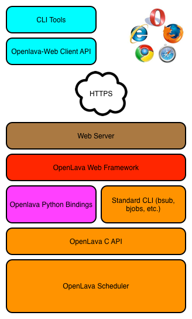

.. Openlava Web Interface documentation master file, created by
   sphinx-quickstart on Wed Feb  5 15:40:43 2014.
   You can adapt this file completely to your liking, but it should at least
   contain the root `toctree` directive.

Welcome to Openlava Web Interface's documentation!
==================================================

Openlava Web is a REST based web interface to the `Openlava scheduling system <http://www.openlava.org>`_. Openlava Web provides both HTML and JSON interfaces allowing users to view information on jobs, queues, hosts, and other components of the scheduling environment.

Openlava Web is written in Python and uses Django as the web framework and is licensed under the GNU Public License.

Users can perform actions such as killing, suspending and submitting new jobs to the cluster. Administrators can perform administrative tasks such as closing and opening hosts or queues. All actions can be done both via the web interface or programatically.

There is a python library (olwclient) that can interact with the remote server and some example command line tools that demonstrate the remote job management capabilities.

Demo
====

You can view the online demo `here <https://openlava.ay60dxg.com/>`_.  Please note, you will need to accept the self-signed certificate.

Contents
========

.. toctree::
   :maxdepth: 4
   
   about
   screenshots
   installation
   olwclient
   commands

Indices and tables
==================

* :ref:`genindex`
* :ref:`modindex`
* :ref:`search`

